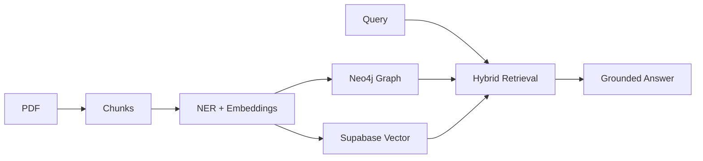

# KG-RAG — Knowledge Graph RAG Application

> Ask questions. Get grounded, citation-backed answers powered by a **hybrid Knowledge Graph + Vector retrieval pipeline**.

## Live Demo
🌐 [kg-rag-frontend.vercel.app](https://kg-rag-frontend.vercel.app)

## Architecture

PDF → Sliding Window Chunking → Concurrent NER + Gemini Embeddings → 
Neo4j AuraDB (entities + relations) + Supabase pgvector (IVFFlat ANN) →
Query Time: Cosine Similarity + BFS Graph Traversal → Grounded Answer



## Why This Is Different From Standard RAG

Standard RAG: embed chunks → find top-K by cosine similarity → generate answer

**KG-RAG adds:**
- **Entity extraction** and relationship mapping at ingestion time.
- **Graph traversal** at query time to find connected facts that pure vector search misses.
- **Citation-backed answers** where every answer references the exact source chunk.

## Tech Stack

| Layer | Technology |
|-------|-----------|
| **Frontend** | React · TypeScript · Vite · Tailwind CSS |
| **Backend** | FastAPI · Python 3.11 |
| **AI/LLM** | Gemini 2.5 Flash (NER + Embeddings + Generation) |
| **Graph DB** | Neo4j AuraDB |
| **Vector DB** | Supabase pgvector (IVFFlat ANN indexing) |
| **Auth** | Supabase Auth (JWT) |
| **Queue** | asyncio background tasks |
| **Deploy** | Vercel (frontend) · Railway (backend) · Docker |

## Running Locally

### Backend
```bash
cd backend
cp .env.example .env  # fill in your keys
pip install -r requirements.txt
uvicorn app.main:app --reload
```

### Frontend
```bash
cd frontend
cp .env.example .env  # fill in your Supabase URL + anon key
npm install
npm run dev
```

## API Endpoints

| Method | Endpoint | Auth | Description |
|--------|----------|------|-------------|
| GET | /health | No | Health check + dependency status |
| POST | /api/ingest | Yes | Upload PDF, start ingestion pipeline |
| GET | /api/status/{job_id} | Yes | Poll ingestion job status |
| POST | /api/query | Yes | Ask a question, get grounded answer |
| GET | /api/documents | Yes | List user's ingested documents |
| DELETE | /api/documents/{id} | Yes | Delete a document |

## Key Engineering Decisions

**Why sliding window chunking?** Overlapping windows ensure that context at chunk boundaries isn't lost — important for multi-sentence entity relationships.

**Why concurrent NER + embedding?** Running both in parallel with `asyncio.gather()` cuts ingestion time roughly in half.

**Why IVFFlat over exact search?** At scale, approximate nearest neighbor search maintains sub-100ms latency without meaningful accuracy loss for semantic retrieval.

**Why BFS over purely vector retrieval?** A question about "company X's CEO" might not semantically match a chunk about "leadership at company X" — but graph traversal connects them directly.
